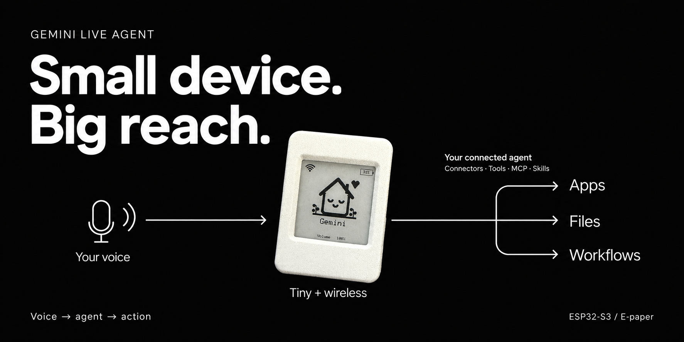

# Gemini Live Agent — ESP32-S3

Source export of the latest saved version, **v3.2 automatic Hermes routing**, saved October 5, 2026.

Voice conversations through Gemini Live, acoustic echo cancellation, e-paper status display, battery indicator, light sleep, backup Wi-Fi, and asynchronous Hermes task routing and completion notifications.

- [Build guide](docs/BUILD.md)
- [Step-by-step setup and use](docs/SETUP.md)
- [Privacy and export details](docs/PRIVACY.md)

This is device firmware; it runs on the matching ESP32-S3 hardware. Hermes is an optional backend placeholder. You can replace it with any agent through a compatible API or adapter; see [agent backend interface](docs/AGENT_BACKEND.md). The backend is a separate service and is not included. Included vendor sources retain their original licenses. No new license is granted for the application code.

The saved v3.2 checkpoint reports successful compilation, flash verification, direct-answer and Hermes-delegation tests. Microphone recognition was not verified in that checkpoint. This export makes the original personal Hermes URL configurable; the rest of the saved firmware is preserved. No hardware is flashed during export.
